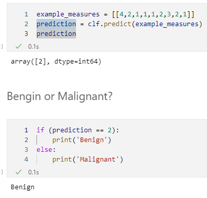

# **BREAST CANCER PREDICTION**

## Libraries
1. numpy
2. pandas
3. matplotlib.pyplot
4. seaborn as sns
5. sklearn

## Data source

This breast cancer databases was obtained from the University of Wisconsin Hospitals, Madison from Dr. William H. Wolberg

O. L. Mangasarian and W. H. Wolberg: "Cancer diagnosis via linear  programming", SIAM News, Volume 23, Number 5, September 1990, pp 1 & 18.

It can be downloaded from  [UCI Machine Learning Repository][1]

## Project Workflow
The workflow for this project is listed below:
1. Preprocessing 
2. Exploratory Data Analysis (EDA)
3. Data Visulization
4. Feature Seletion
5. Training & Testing
6. Confusion Matrix
7. Conclusion

## Model Selection
We tried Four Machine Learning Models and evaluated their performance with our Breast Cancer Dataset. The models are listed with their training accuracy below:
1. Decision Tree: Mean accuracy = 0.954974 & Std accuracy is 0.020103
2. Support Vector Machine: Mean accuracy = 0.971386 & Std accuracy = 0.013512
3. Gaussian Naive Bayes: Mean accuracy = 0.963223 & Std accuracy = 0.025463
4. KNN', K-Nearest Neighbors: Mean accuracy = 0.969345 & Std accuracy = 0.016428

## Test Result
Training shows that the Support Vector Machine model has the highest training accuracy. So we further tested our test dataset with SVC and the Test Accuracy was 0.9714285714285714 (97.14%)

## Random Testing

We provided a list of numbers as an input for nine features and it accurately predicted the class for breast cancer.

-----------------------------------------------------------------------------------

## Confusion Matrix

## Conclusion
We had Wisconsin Breast Cancer Database with 699 records on 11 columns. 

Attributes at column indices 2 through 10 have been used to represent instances.
* Each instance has one of 2 possible classes: benign or malignant.
* These classes was included as attribute at column index 11

Class distribution was:
1. Benign: 458 (65.5%)
2. Malignant: 241 (34.5%)

After processing data and obtaining analysis from it, we split the dataset into train-test of 70%-30%. we trained four models. By far, SVM model had highest accuracy for training and test data.

[1]: https://archive.ics.uci.edu/ml/machine-learning-databases/breast-cancer-wisconsin/breast-cancer-wisconsin.data "UCI Machine Learning Repository"
